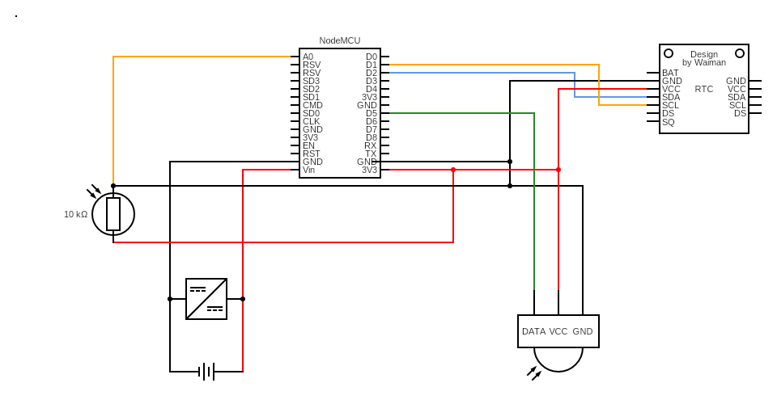

# Light Usage Monitoring and Notification System

This project involves developing a NodeMCU-based light monitoring system that tracks light usage and motion in multiple rooms.

The system sends notifications to the user if the light is left on when no motion is detected, helping to reduce energy wastage. Data from each room is logged in Firebase and displayed in a mobile web app for real-time monitoring.


## Link to the GitHub Repo
- [Link to repo](https://github.com/Adura-Hephzibah/light_monitoring_system.git)


## How to Set Up the Project

### Prerequisites:
- NodeMCU or ESP8266
- Arduino IDE
- Firebase account
- PIR motion sensor and LDR sensor
- Circuit setup (refer to the circuit diagram below)

### Steps:
1. Clone the repository:
```bash
git clone https://github.com/Adura-Hephzibah/light_monitoring_system.git
```

2. Open the project in Arduino IDE and install the following libraries:
    - Firebase ESP8266
    - ESP8266WiFi

3. Set up your Firebase project:
    - Create a Firebase Realtime Database.
    - Add your Firebase credentials to the src/main.ino file.

4. Upload the code to your NodeMCU using Arduino IDE.


## Designs

- Figma Mockup:
  

- Circuit Diagram:
  

## Deployment Plan

The system consists of three NodeMCU devices installed in separate rooms. Each device monitors light usage and motion, sending real-time data to Firebase. A mobile web app is hosted using Firebase Hosting, allowing users to monitor the status of each room and receive notifications when lights are left on without motion detected.

### Deployment Steps
1. Deploy the mobile web app using Firebase Hosting.
2. Set up the NodeMCU devices in the three rooms, each configured with a unique identifier.
3. Ensure that data is logged in the Firebase Realtime Database, and the web app fetches and displays this data in real-time.


## Video Demo
[Link to video demo](https://drive.google.com/file/d/1tP4qcQOqwGqdLLtGYvbjYaBl0XFT9Axk/view?usp=sharing)
